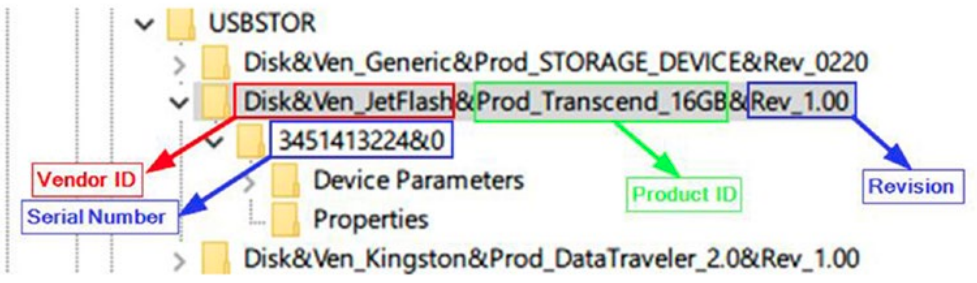

# Lab 3 - Forenzika USB uređaja

Zamislite sljedeći scenarij: sutradan imate kolokvij iz iznimno kompliciranog kolegija Računalna forenzika. Problem je u tome što nitko ne zna kako će kolokvij izgledati, primjeri kolokvija prošlih godina ne postoje, a skraćene verzije verzija skripti za učenje još nitko nije pripremio.

Međutim, saznalo se da je profesor pripremio kolokvij te ga drži spremljenog na svom računalu. U trenutku neopreznosti profesor, koji ostaje kasno na fakultetu zbog rokova na nekom projektu, odlazi van ureda uzet kavu na aparat, ne zaključava ured, te pri povratku zatekne upaljen ekran računala na kojem se nalazi otvoren direktorij u kojem je kolokvij. Sumnja se da je kolokvij procurio...

## Vježba

Zadatak forenzičara je saznati je li u trenutku neopreznosti bio spojen USB memorijski ključ spojen na računalo na kojeg je mogao biti kopiran kolokvij.

Operacijski sustav Windows 10 sadrži interni log u koji sprema listu (USB) uređaja koji su prvi put bili povezani na računalo. Ime datoteke je `setupapi.dev.log` koja se nalazi u direktoriju `\Windows\inf\`. Iz direktorija [Download](Download) sačuvajte datoteku `setupapi.dev.log` koju je forenzičar pripremio za vas.

Vaš zadatak je napraviti skriptu u pythonu koja parsira navedenu log datoteku te ispisuje sve USB uređaje koji su bili prvi put povezani na računalo kao i vrijeme u kojem su se prvi put povezali na računalo. Na slici ispod možete vidjeti koji su parametri jedinstveno identificiraju uređaj. 



Na ekranu ispod možete vidjeti dio loga u kojem su parametri USB uređaja zapisani u log datoteku:

```
>>>  [Device Install (Hardware initiated) - SWD\WPDBUSENUM\_??_USBSTOR#Disk&Ven_JetFlash&Prod_Transcend_16GB&Rev_1.00#3451413224&0#{53f56307-b6bf-11d0-94f2-00a0c91efb8b}]
>>>  Section start 2021/01/19 11:29:24.146
     dvi: {Build Driver List} 11:29:24.166
```

Poznavajući način na koji se u računalo sprema datoteka, možete parsiranjem veoma brzo izvući listu svih uređaja kao i trenutak u kojem se USB bio prvi put spojen na računalo.
